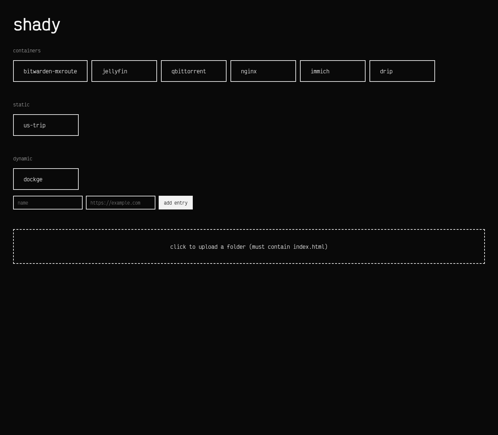

# shady

Shady is a small dashboard that aggregates:
- running containers labeled with `shady.name` and `shady.url`
- uploaded static folder previews (each folder must include `index.html`)

It is useful as a lightweight local launcher for containerized tools and static mini-sites.

## Usage

### Running

Get the reference docker-compose file [here](./docker-compose.example.yml), then:

```bash
docker compose up -d
```

The app will be available at:

`http://localhost:7111` (default)

### Add containers to the dashboard

Any running container with these labels appears in the **containers** section:

- `shady.name`: display name
- `shady.url`: target URL

Example snippet in any compose service:

```yaml
labels:
  shady.name: my-service
  shady.url: http://localhost:8080
```

### Upload static folders

In the dashboard, use the upload area to select a folder.

Requirements:
- folder name becomes the display name
- folder must contain `index.html` at its root
- referenced assets (css/js/images) can live inside that folder and subfolders

### Stop

```bash
docker compose down
```

## Screenshots


