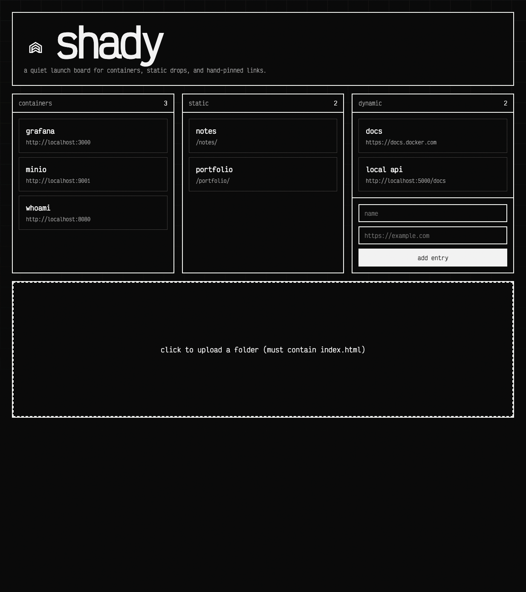

# shady

Shady is a small dashboard that aggregates:
- running containers labeled with `shady.name` and `shady.url`
- uploaded static folder previews (each folder must include `index.html`)
- dynamic links added from the dashboard

It is useful as a lightweight local launcher for containerized tools and static mini-sites.

The interface is intentionally minimalist: monochrome, squared corners, dense cards, and a quiet grid backdrop.

## Usage

### Running

Get the reference docker-compose file [here](./docker-compose.example.yml), then:

```bash
docker compose up -d
```

The app will be available at:

`http://localhost:7111` (default)

### Development mocks

To work on the dashboard without mounting or reading the Docker socket, start the app with mocks enabled:

```bash
SHADY_USE_MOCKS=1 uv run python app.py
```

When `SHADY_USE_MOCKS` is set to `1`, `true`, `yes`, or `on`, Shady skips the Docker socket and loads dashboard data from [`resources/mocks.json`](./resources/mocks.json) instead.

The mock file supports the same three dashboard sections:

```json
{
  "containers": [{ "name": "grafana", "url": "http://localhost:3000" }],
  "static_files": [{ "name": "portfolio", "url": "/portfolio/" }],
  "dynamic_entries": [{ "name": "docs", "url": "https://docs.docker.com" }]
}
```

This is useful for UI development, screenshots, and local testing on machines that do not expose `/var/run/docker.sock`.

While mocks are enabled, dynamic entries are shown from `resources/mocks.json`; the dashboard add/delete controls are hidden so mock data stays file-driven.

### Add containers to the dashboard

Any running container with these labels appears in the **containers** section:

- `shady.name`: display name
- `shady.url`: target URL

Example snippet in any compose service:

```yaml
labels:
  shady.name: my-service
  shady.url: http://localhost:8080
```

Container entries are sorted by name. If the Docker socket is unavailable, Shady keeps running and reports the Docker status in the dashboard header.

### Dynamic links

Use the **dynamic** form to add hand-pinned links. URLs must start with `http://` or `https://`.

Dynamic links are stored in `config/dynamic.json` and can be removed from the dashboard with the `×` button.

### Upload static folders

In the dashboard, use the upload area to select a folder.

Requirements:
- folder name becomes the display name
- folder must contain `index.html` at its root
- referenced assets (css/js/images) can live inside that folder and subfolders

### Stop

```bash
docker compose down
```

### Healthcheck

Shady exposes a simple health endpoint:

```text
GET /health
```

It returns JSON with `ok`, `docker_status`, and `use_mocks`.

## Screenshots


